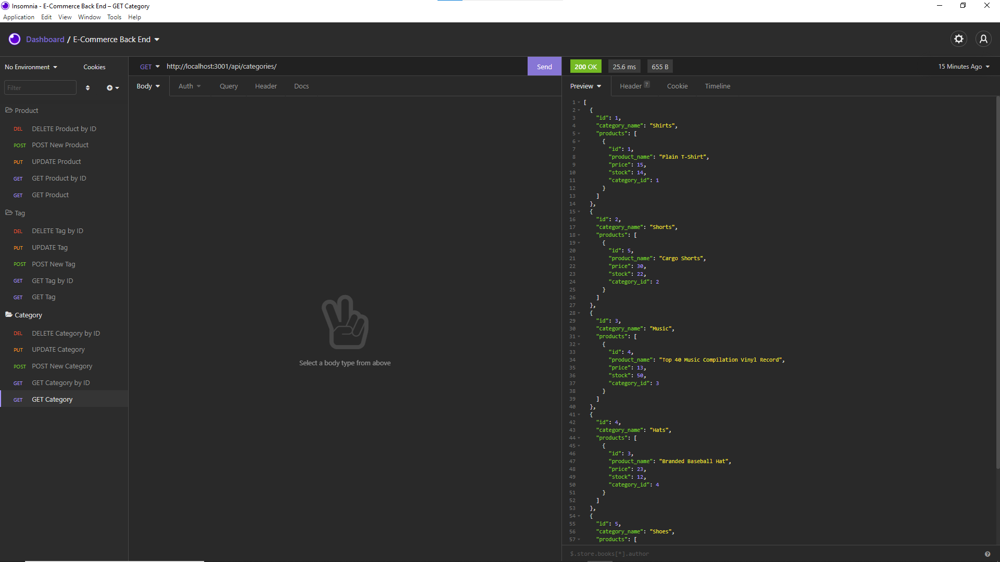

# e-commerce-backend

Walkthrough Video: https://watch.screencastify.com/v/SFjVgtLMeFjILtMitxdK

Repository: https://github.com/curriecoder/e-commerce-backend

## Description

This project was motivated by a desire to implement Sequelize to manage a back end database. I learned how to use sequelize on this project and I really appreciate this module after going through vanilla SQL first. This application solves the problem of not having a database for an e-commerce website.

## Usage

Instructions: Begin the application by running 'npm install' to install all dependencies. After installation is complete, log in to MySql and build the database with 'source schema.sql'. Quit out of MySql and then run 'npm run seed' to seed the database with some example data. The user can now test all of the C.R.U.D. operations for the E-Commerce Back End.

  

## Credits

I would first like to thank the instructors of UPenn LPS Coding Bootcamp class of 08-2021 for continually putting the students at the top of the importance list. As always, thanks to the community of devs that are there for me to rubber duck all of the issues I can't solve in my head.

## License

MIT License

Copyright (c) [2021] [Andrew J. Currie]

Permission is hereby granted, free of charge, to any person obtaining a copy
of this software and associated documentation files (the "Software"), to deal
in the Software without restriction, including without limitation the rights
to use, copy, modify, merge, publish, distribute, sublicense, and/or sell
copies of the Software, and to permit persons to whom the Software is
furnished to do so, subject to the following conditions:

The above copyright notice and this permission notice shall be included in all
copies or substantial portions of the Software.

THE SOFTWARE IS PROVIDED "AS IS", WITHOUT WARRANTY OF ANY KIND, EXPRESS OR
IMPLIED, INCLUDING BUT NOT LIMITED TO THE WARRANTIES OF MERCHANTABILITY,
FITNESS FOR A PARTICULAR PURPOSE AND NONINFRINGEMENT. IN NO EVENT SHALL THE
AUTHORS OR COPYRIGHT HOLDERS BE LIABLE FOR ANY CLAIM, DAMAGES OR OTHER
LIABILITY, WHETHER IN AN ACTION OF CONTRACT, TORT OR OTHERWISE, ARISING FROM,
OUT OF OR IN CONNECTION WITH THE SOFTWARE OR THE USE OR OTHER DEALINGS IN THE
SOFTWARE.

---